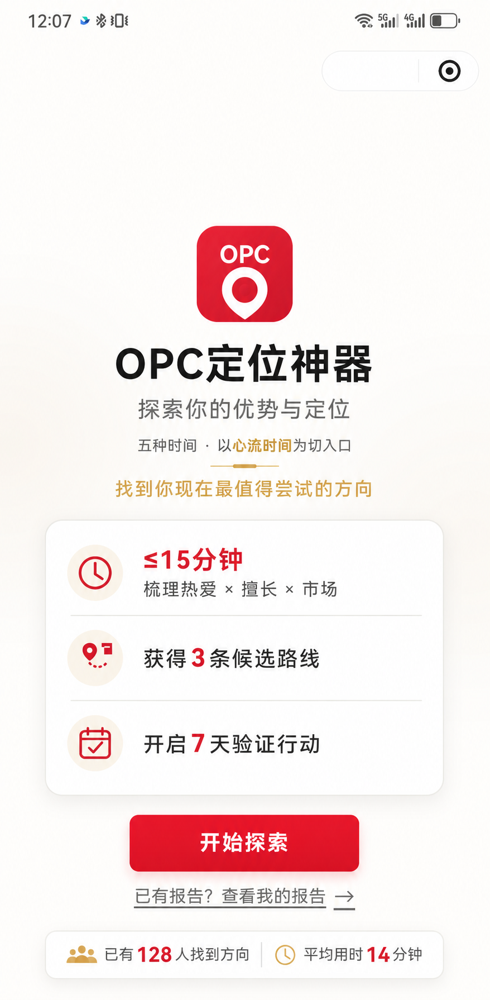

# OPC定位神器（公开展示）

一个帮助用户从个人经历与现实约束出发，找到当前最值得尝试方向的微信小程序 MVP。

> 本仓库仅用于项目展示，不包含源代码、完整 PRD、Prompt、评分规则或商业方案，也不是开源仓库。

## 它解决什么问题

当一个人想转型、发展副业或寻找个人优势时，常见困难不是“没有想法”，而是想法太多、缺少证据，也不知道先验证哪一个。

OPC定位神器把零散经历整理成可核对的个人证据，给出候选路线，并把选择落到一个短周期验证行动上。

## 核心体验

1. 完成一组结构化问题；
2. 查看系统从回答中提取的个人证据；
3. 获得 3 条候选路线；
4. 结合市场机会和现实约束选择优先路线；
5. 生成 7 天低后悔验证行动。

更完整但不涉及实现细节的说明见 [公开版功能说明](docs/公开版功能说明.md)。

## 演示截图

### 首页

### 三条候选路线过渡页

### 证据与候选路线示例

截图中的回答、数字和路线均为虚构演示内容，不代表真实用户信息或实际运营数据。

## 当前状态

- 阶段：MVP Demo 验证
- 用途：产品演示、真机体验和早期用户反馈
- 边界：结果用于生成验证方向，不代替职业、投资或人生决策

## 公开范围

本仓库只公开项目简介、精简功能说明和演示截图。源代码、完整产品文档、模型 Prompt、内部规则、测试数据及商业规划保存在私有仓库。

## 权利声明

Copyright © 2026 OPC定位神器项目作者。All rights reserved.

除 GitHub 平台正常浏览和 Fork 功能外，本仓库未授予复制、修改、分发或商业使用其中内容的许可。如需引用或合作，请事先联系项目作者。
